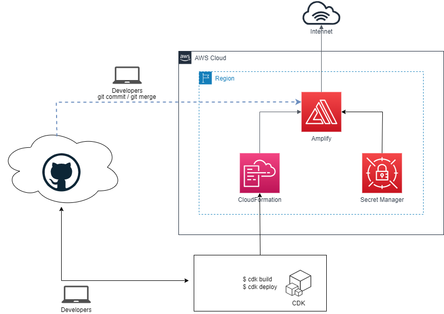

# Static Website with AWS Amplify and CDK

In this project, I use AWS Amplify to host a sample Vue application as a static website.

The figure below shows the AWS services and the steps involved in deploying the sample Vue application using Amplify and CDK.

1. Build static websites or the frontend of a full stack application and commit the code to any of the repositories GitLab, GitHub or AWS CodeCommit. Here I use GitHub to host a simple Vue application.
2. Setup AWS CDK project, build and deploy the CDK code to the target AWS region to create the Amplify application.
3. The CDK code will be converted to a CloudFormation template which will be deployed in the target region to create the Amplify Application.
4. Any subsequent commits will trigger the Amplify continuous deployment pipeline which will fork the code from the configured repository. For GitLab and GitHub, AWS Secrets Manager can be used to store the personal access token which provides Amplify the permission to access the repository.
5. Amplify will generate a shareable URL which can be used to access the application from the internet.



**Notes**:

1. I created a sample Vue application for demo purpose, see `https://github.com/camillehe1992/sample-vue3-app`, you can take it as a reference. If you want to deploy your own project using Amplify, feel free to create one and commit the code to any of the repositories GitLab, GitHub or AWS CodeCommit, then generate a personal access token so that any subsequent commits will trigger the Amplify continuous deployment pipeline.
2. Here is a guide to create a personal GitHub access token https://docs.github.com/en/authentication/keeping-your-account-and-data-secure/creating-a-personal-access-token.

## Setup

```sh
# cp .env.sample to .env and update your AWS account/region as well as GITHUB_OAUTH_TOKEN generated before
# Install dependencies
npm install

# Deloy stacks into your AWS account/region
npm run deploy

# Destroy stacks from your AWS account/region
npm run destroy
```

The `cdk.json` file tells the CDK Toolkit how to execute your app.

## Useful commands

- `npm run build` compile typescript to js
- `npm run watch` watch for changes and compile
- `npm run test` perform the jest unit tests
- `cdk deploy` deploy this stack to your default AWS account/region
- `cdk diff` compare deployed stack with current state
- `cdk synth` emits the synthesized CloudFormation template

## References

https://docker.awsworkshop.io/41_codepipeline/10_setup_secretsmanager_github.html
