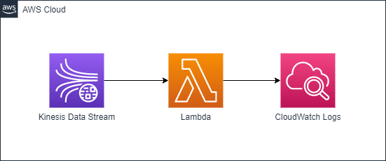

# Streaming Data into Lambda via Kinesis Data Stream

In this project, I create a Kinesis Data Stream which integrates with Lambda function as consumer. For test purpose, after deploying the resources to AWS, you can use `put-record.sh` script to put a record into stream, then the downstream lambda will be invoked and print the record string in CloudWatch Logs.



## Setup

```sh
# cp .env.sample to .env and update your AWS account/region
# Install dependencies
npm install

# Deloy stacks into your AWS account/region
npm run deploy

# Destroy stacks from your AWS account/region
npm run destroy
```

The `cdk.json` file tells the CDK Toolkit how to execute your app.

## Useful commands

- `npm run build` compile typescript to js
- `npm run watch` watch for changes and compile
- `npm run test` perform the jest unit tests
- `cdk deploy` deploy this stack to your default AWS account/region
- `cdk diff` compare deployed stack with current state
- `cdk synth` emits the synthesized CloudFormation template

## References
