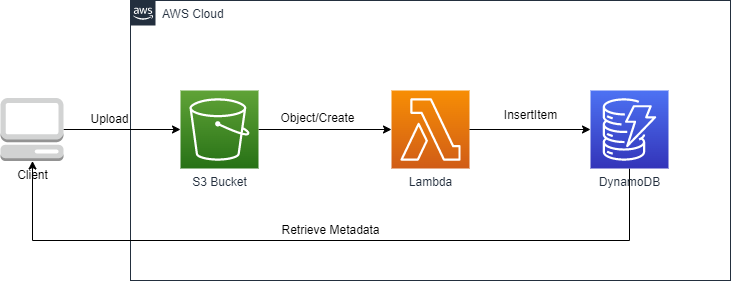

# Use Dynamo DB to save object metadata information that uploaded into S3 bucket

This project is a common use case in most blogs and examples. Basically, Amazon Simple Storage Service [Amazon S3](https://docs.aws.amazon.com/AmazonS3/latest/userguide/Welcome.html) is an object storage service that offers industry-leading scalability, data availability, security, and performance. , and [Amazon DynamoDB](https://docs.aws.amazon.com/amazondynamodb/latest/developerguide/Introduction.html) is a fully managed NoSQL database service that provides fast and predictable performance with seamless scalability. To make it simple, we use S3 to save large files and DDB for some metadata of these files.

Below diagram shows the workflow. User uploads a file to S3 bucket with Object:Create event configured. The event triggers downstream lambda function to process and persist the metadata of file into DynamoDB. Finally Client side can retrieve and display the metadata information from DynamoDB.



## Setup

```sh
# cp .env.sample to .env and update your AWS account/region
# Install dependencies
npm install

# Deloy stacks into your AWS account/region
npm run deploy

# Destroy stacks from your AWS account/region
npm run destroy
```

The `cdk.json` file tells the CDK Toolkit how to execute your app.

## Useful commands

- `npm run build` compile typescript to js
- `npm run watch` watch for changes and compile
- `npm run test` perform the jest unit tests
- `cdk deploy` deploy this stack to your default AWS account/region
- `cdk diff` compare deployed stack with current state
- `cdk synth` emits the synthesized CloudFormation template

## References
