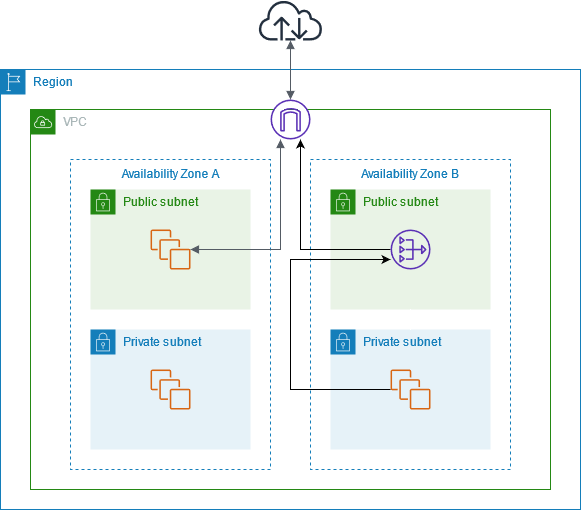

# Welcome to your CDK TypeScript project

In AWS Cloud, most of services are secured by a series of network resources, such as VPC, Subnet and Security Group. As a start point of your journey in AWS, the project provides a basic network infrastructure.

The following diagram illustrates this use case. There are two Availability Zones, with two subnets (one public, one private) in each Availability Zone. The route table for each subnet determines how traffic is routed. In Availability Zone A, the instances in the public subnet can reach the internet through a route to the internet gateway, while the instances in the private subnet have no route to the internet. In Availability Zone B, the public subnet contains a NAT gateway, and the instances in the private subnet can reach the internet through a route to the NAT gateway in the public subnet. The NAT gateway sends the traffic to the internet gateway, using its Elastic IP address as the source IP address.

Besides, I created a S3 Gateway endpoint to enable private connectivity between VPC and S3, so that applications in VPC can access S3 service via this endpoint directly.



## Setup

```sh
# cp .env.sample to .env and update your AWS account/region
# Install dependencies
npm install

# Deloy stacks into your AWS account/region
npm run deploy

# Destroy stacks from your AWS account/region
npm run destroy
```

The `cdk.json` file tells the CDK Toolkit how to execute your app.

## Useful commands

- `npm run build` compile typescript to js
- `npm run watch` watch for changes and compile
- `npm run test` perform the jest unit tests
- `cdk deploy` deploy this stack to your default AWS account/region
- `cdk diff` compare deployed stack with current state
- `cdk synth` emits the synthesized CloudFormation template

## References

https://docs.aws.amazon.com/vpc/latest/userguide/nat-gateway-scenarios.html
https://docs.aws.amazon.com/vpc/latest/userguide/endpoint-services-overview.html
